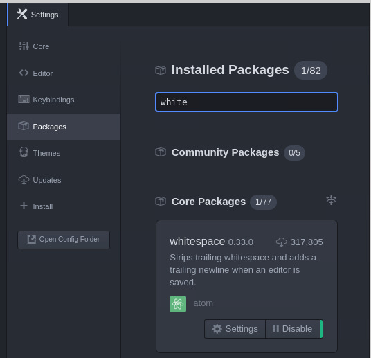

## Table of Contents
* [Week one and two](#week-one-and-two)
* [Week three](#week-three)
* [Week four](#week-four)

## Week one and two

Q1
=============
_How do I do a for loop in fish where I designate a number instead of it going through all the contents of a file? [group: type an example in your terminal and then I will display your screen]_

This was discussed in class.  I am not entirely sure what is being asked here but:

```
for num in 1 2 3 4 5
    echo $num #print the current number to the screen
    touch file$num.txt #creates a file with the current number in the name
    end
    
ls # see what we have done
```

Q2
=============
_I am still unsure of how to eliminate new line space from the character count of genome/proteome files._

Discussed in class.  

Laurel and Melodie came up with this:
```
grep -v ">" protein.fa | tr -d \n | wc -c
```

Great solution.  I was doing something less elegant: using `wc` to give me both a character and a line count.  Then manually subtracting the line count from the character count.

Q3
=============
_Im still a little confused about what the "grep" command is, and when it should be used. Can you clarify the function of this command?_

`grep` searches for something in a file and returns lines that have a match.  Options to return lines that don't match, to count the number of lines that match, to return lines before or after the match, etc.

See `man grep`

Q4
=============
_Why are the scores for aligning B0213.10 with the best-matching A.thaliana and D.melanogaster proteins so high, yet the % identities so low?_

Discussed in class.  1) because similar amino acids can still have a positive score; 2) If you look at a scoring matrix general the matches are more positive than the mismatches are negative; 3) 35% identity really probably does mean shared ancestory.

Q5
=============
_Could you please explain more about statistical significance and biological relevance. In case if your data is statistically significant but biologically not that relevant, how do you handle it?_

Discussed in class.  Basically it is your decision as a researcher what is likely to be biologically significant.  Just be sure to explain your reasononing.

Q6
============
_If we shuffle enough more times of a sequence, would the alignment of a protein with it will be normally distributed? or still skewed?_

Discussed in class.  1) Try it!  2) Still skewed.  Why?  Skewing results from the fact that this is a local alignment and that *some* aligment will be found and reported.  Anti-alginments are not reported.  Skew also may result from composition similarities between the sequences.  (Think about if both sequences were 50% S but unrelated).

Q7
=============
_If the distribution of the alignment score is not normal, how could we use z-score and determine the E-value?_

Although skewed the distributsion is still unimodal so the Z-score is still informative about how many SDs away from the mean you sequence is. 

You can then determine what percentage of your random sequences had at least that large of a Z-score.  So if your Z-score is 2.5 and only 3% of your random sequences have a Z-score > 2.5, then your E-value is ~ 3%. (Although you could also just do this directly with the alignment score).

Q8
==========
_Many questions about calculating speed of alignment_

My recommended pipeline:

* Align one protein sequence (query) against proteome#1 and time it.
* Divide that time by the the number of amino acids in your query to give seconds/amino acids when aligning to proteome#1
* Determine the number of amino acids in proteome#2
* Multiple your rate (sec/aa) * number of amino acids in proteome#2

Q9
=============
_What exactly is an alias?_

It is a pointer to the files true location

Q10
===============
_When doing BLAST, how do we decide what parameters to use when comparing two sequences?_

Decide on your goals and priorties:

* Sensitivity?
* Speed?
* Only closely related matches?
* Distant matches?

There is no one right answer, it is tradeoffs

Q11
========
_Is there a limit to the number of pipelines one can create in a single command?_

Not that I am aware of.  Readibility becomes limiting.

Q12
======
_How to researchers determine what is a good cutoff at which point to consider two sequences homologous? It all seems kinda arbitrary from the assignment._

E-values and match length.  I like to see that the alignment stretches across most (75%?) of the protein that I am looking at, even if it is a low percentage.  If I have a good match but only for 30% of the protein that might indicate a homologous domain but not the whole protein.

Q13
========
_Is there a way to visually see the overlap/comparison between two genomes/proteomes? Say like in a venn diagram?_

Should be easy to do in R, maybe I will include this when we move to R


Q14
=======
_Is there a particular programming language languages that are the best to know for programming in Bioinformatics?_

R and Python, plus at leat a bit of Linux shell

Q15
======
_Why do the 2 spaces after a line that separates the lines in markdown disappear when I save the file?_

Sorry.  I thought I fixed this but I didn't.

In Atom: Edit > Preferences > Packages.  Then search for "whitespace" and click disable



Also, should be fixed in new installations of Atom.

Q16
========
_this is my first time learning how to use GitHub - So I‚am a bit confused and was wondering how do we see our work as a site (like_

Go to [](https://github.com/orgs/UCDBIS180L-18/) and then click on your repository.  You should be able to click on a filename and then see it in your web browser.

Q17
=====
_"Can you talk more about awk?"_

Powerful but cryptic text processing language.  There are books about it.  Probably better off learning Python.

Q18
=======
_What is the difference between our t2 medium and t2 large instances, and in what situation would  we use one instead of the other?_

t2.medium has 4GB RAM and t2.large has 8GB.  If we are doing a memory intensive task then we will switch to large.

Q19
=======
_How does the type of scoring matrix used affect the run time?_

A scoring matrix designed for more distantly related sequences will not penalize mismatches as much.  Thus there will be more initial matches and runtime will be longer.

Q20
=========
_I chose a threshold of 150 but wanted to know what is considered statistically significant and acceptable for proteome comparisons._

There is not one proper answer here.  It would depend if you are interested in only close matches or in more distant matches.  150 is too high to find distant matches.

Q21
=========
_How do you calculate the number of bp in the genome in all one step?_

See Q2

Q22
======
_Can you find the Z-score using the command line?_

Yes, although not too easy.  You can google "awk standard deviation" to see how that would work.  And then use the command line calculator `bc`

Q23
=======
_After ""pushing"" Assignment 1 onto github, I noticed that for the markdown chart I made for question 2 is formatted incorrectly, yet in the ""toggle preview"" on Atom the chart was fine._

The number of separators in the header (first line of the table), separator ("|:---|:--------|:--------|:-------------|"), and he rest of the table needs to match.  In your case it doesn't.

Q24
========
_What exactly is linux/unix (ie. a processor, a language, a computer program?)_

An operating system.  If you run a Windows PC there is an operating system that displays windows, manages files, etc.  Linux or Unix are alternative operating systems.

The operating system is still a progrom (or a series of programs).  But they are the "core" programgs.

Q25
=====
_I'm still not sure what tar balls are and when I would use them. Would using a tar ball have been appropriate/faster when setting up the file structure at the beginning of the first lab?_

A way of archiving and compressing a set of files and directories into a single file.  So they are useful for sharing a set of files with others.  You would still need to set up the directory and file structure first so I don't see that it would have helped for the first lab.  (Although if I had created one for you then you could have downloaded and unpacked it and been all set).

Q26
=====
_Are assignments supposed to be markdown format? We we are supposed to "paste" code is there anything special we are supposed to do in that case?_

Yes, they are supposed to be in markdown format.  When including code you need to use proper markdown so that it is formatted as a code blocks.  This is explained in the markdown lab.

Q27
=====
_How do you determine the default parameters for water and BLAST? I can't seem to find it in the -help command._

For water `man water`.  For BLAST, some are shown using `blastp -help` but not all.  For the others run a blast and then look at the end of the output file.

Q28
=====
_In for loop, sometimes we say echo {$x} and sometimes we say echo "$x". What is the difference?_

including the "{}" makes it more clear to the shell where the variable is.  This would important if you had the variable $x and $xylophone.

```
set x foo
set xylophone bar
echo $x
echo $xylophone
echo {$x}ylophone
```

Q29
=========
_is there a way to log all the terminal activity automatically and store it somewhere so I can be lazy and not copy/paste all the commands I typed in a given session?_

```
history
```

Q30
========
_Does BLOSUM matrix with a higher percent identity gives a lower score with the same data? Or not? Why is that?_

1) Look at the different matrices and make a hypothesis.  2) Test it.


## Week Three

Q1
==========
_When would we prefer to use Linux vs R?_

For text file and data manipulation choose which interface you prefer.  (I like R).

Otherwise choose which actually has the functionality to get the job done.  Many bioinformatics programs are written in C and must be invoked at the linux command line.

Q2
====
_Is the terminal tab on the R left screen the same as using the terminal we've been using? Or is it a special R terminal?_

There is the __R Console__ tab which give you access to R itself and there is the __terminal__ tab, which, yes, gives you command-line access to the Linux shell similar to what you have been using.  Going through R probably gives you bash instead of fish.


Q3
====
_In assignment 2, question 7, it says to find a worm gene with single plant ortholog. However, I am not quite sure about what does single mean here. If I found more than one genes in plant that could hit the worm gene, would each one of the plant genes still be single orthologs of the worm gene, or I should choose the best one out of the plant genes to be the single ortholog of the worm gene?_

Where there is one hit with an E-value or score much better than any other hits.

Q4
======
_When would it be helpful to use the 'dim' function?_

To check the number of rows and columns in your data to make sure it makes sense.  Or to convert a vector to a matrix.

Q5
=======
_Since orthology is difficult to determine by the reciprocal BLAST method, what other method would you use to ascertain whether two genes are actually orthologous?_

Phylogeny.  Next best: compare E-values from best hit to next best hit.  

Q6
=====
_How can we use BLAST to distinguish paralogs from orthologs from homologs?_

Orthologs and paralogs are both specific types of homologs, so you can't distinguish homologs from them.  For paralogs do a BLAST of a proteome against itsself.  For orthologs compare different proteomes.

Q7
=====
_How do you know if a file is in the BLAST database format or not and when not to use the formatdb code?_

Go to to directory where the fasta file is and look for a db_log file.

Q8
======
_What does the str() function do? How do I read it?_

Shows hierarchical structure of a data object.  Hopefully you were in class to see the example.

Q9
=======
_How is the tidyverse package related to the tidyr package and/or the plyr package? (hint: go to tidyverse.org)_

Tidyverse is a meta-package that contains these and more.


Q10
=====
_How do you decide which matrix and threshold is best for your data?_

Time vs sensitivity.

_What BLAST parameters are usually used when trying to find homologs in distantly related organisms?_

small word size, low threshold, BLOSUM matrix for distantly related sequences.

Q11
======
_How to decide on the best word_size and threshold values for your alignment (specially for proteome alignment as it takes so long)? What factors would you consider while deciding these values?_

Time vs sensitivity.  Really a few hours isn't that much time...


Q12
===
_Are there software packages that integrate all of the tools we have learned about (BLAST, general sequence analysis/inspection, R statistical analysis) into one place?_

BIS180L AWS image?

More seriously, Python and perl have interfaces to BLAST.  R does as well although I am not sure if it is as well developed.

Programs like CLC workbench (not free) integrate a fair number of sequence analysis tools, but you lose flexibility.

Q13
===
_What are the advantages of GG plots vs regular plots?_

1) extremely easy to assign your variables to plot aesthetics, e.g. color points by treatment, etc.

2) default plots look much nicer than plots using base R graphics.


Q14
===
_In what scenario will we prefer to use && to compare only the first element of the vector, instead of &?_

I don't think I have ever used &&

Q15
=====
_Is it possible to do 3 proteome comparisons on either platform? For example... if i wanted to compare A, B, C. (AB, BC, AC).. Could this be done in one blastp_

No, needs to be done sequentially

Q16
====
_Also, is there a generally accepted rule for determining cutoff values for E-value other than trial and error?_

You have to think about what your biological question is.

Q17
====
"Why is it that when I click on knit in R markdown, I get this error?

Error in eval(parse(text = name)) : object 'R_lab_notebook' not found
Calls: <Anonymous> -> create_output_format -> eval -> eval
Execution halted

Please ask me or Jiadong

Q18
===
_When did you (Maloof) begin coding?_

I was 11 or 12 when the first Apple (Apple II) came out.  My school had a couple and then my Dad got one.  So I started playing around then.  

I had an account on a Unix main-frame in highschool and played around some then to, but nothing serious.

Took two programming classed in college.

Got serious as a postdoc and professor as Biology became more data-intensive.

Q19
====
_Since orthology is difficult to determine by the reciprocal BLAST method, what other method would you use to ascertain whether two genes are actually orthologous?_

reciprocal BLAST is good for genome-level analyses.  Incoroporating next-best hit is helpful.

phylogentic trees are the best on a case-by-case basis but hard to do genome-wide.

Q20
====
_"when E values is zero or relatively close to zero, why the actual best hit sequence can still have lots of AA variations compared to query sequence?_

See Assignment 3...

Q21
====
_Why we use BLOUSM62 as the default search parameters? What is the advantage of using it compared to other BLOUSM scoring matrix?"_

Good middle-of-the road matrix.  Higher BLOSUMs make it harder to find distant relatives.  Lower BLOSUMS may make it hard to distinguish the "best" hit among closely related proteins.  Also probably slower. 

Q22
=====
_If I modify the file structure of my documents the links I made to the affect files no longer work. Is there an easy way to make or edit links to multiple documents using one line of code, or do you have to address each link individually? This occurred when I moved my Assignment_1 folder into my git directory for Assignment 1._

It might be able to do this with a for loop.

Q23
===
_"The `swirl()` tutorial mentions that missing values are important to note and further analyze when looking at a data set. What are some real life examples/methods of interpreting information from missing values?_

Need to know why the data is missing.  Does missing mean "0" or just that the measurment wasn't taken.

_Also, why is it important to concatenate all of the missing values to begin with, outside of realizing that the data may be lacking?_

Not sure what this is referring to.

Q24
===
_Are there a lot of packages available to visualize data in such a way that you do not need to code in R?_

Python has good plotting but I assume you mean without having to code at all.

People like [PRISM](https://www.graphpad.com/scientific-software/prism/)

Q25
=====
_What does "best match" mean? Does it all related to E-value, score or other parameters?_

_How does BLAST determine the ""best 4 matches"" ?_

This is based on score.

Q26
====
_Why are there more than 4 hits shown even when using ""-max_target_seqs 4""?_

4 for EACH query sequence.

Q27
====
_When working with programs like Blast the time is still very long.  I know there has been a push to move to more GPU based analysis to take the load off the CPU.  Do you feel that push has been successful or are most of the programs like BLAST very CPU dependent?_

I think that there is a GPU version of BLAST.  My understanding is that the GPU speed-up depends a lot on the specifics of the task.

I don't see that many bioinformatics programs taking advantage of GPU but I am not sure if that is because the people writing these programs don't take the time to optimize them for GPU or if there isn't a big advantage.  (I do see that most programs can take advantage of parallel processing on multiple CPUs).

Q28
====
_In what situation would we rely on a property other than E value, like percent identity, to determine if two proteins are paralogs. In other words is there ever a situation where it is especially bad to use E values to determine the relatedness of two proteins?_

_What exactly makes something a paralog? Similar function and a low E-value, but how do you know when an E-value becomes too big to be considered a paralog?_

I like looking at p-value and the length of the alignment relative to the length of the query and subject.


Q29
===
_How can you determine which genes are isoforms and which ones are identical to the query?_

Truly identical should have the same name.

ISoforms: We could do some parsing of the names.

Combine that with the BLAST results; 100% match across the full length of the query and subject...


## Week four

Is it known whether or not the tidyverse functions use less computing power than equivalent functions in Excel?
========

Not by me.  However, generally I have found that things don't scale well in Excel when you get into the hundreds of thousands of entries.  Also who wants to drag across that many rows?  (I know you can fill down...)


What is the fastest way to convert continuous data into discrete categories in a table?
======

`cut_interval()` dvidides into equally-spaced groups; `cut_number()` divides into groups with equal number of observations; `cut_width()` allows you to specify the interval width, and `cut()` allows you to specify the break points.


```r
tomato <- tomato %>% mutate(hyp.category = cut_interval(hyp,n=10))
tomato %>% select(hyp,hyp.category) %>% head()
```

```
# A tibble: 6 x 2
    hyp hyp.category
  <dbl>       <fctr>
1 19.46    (13,19.9]
2 31.28  (26.7,33.5]
3 56.65  (54.1,60.9]
4 35.18  (33.5,40.4]
5 35.32  (33.5,40.4]
6 28.74  (26.7,33.5]
```


```r
table(tomato$hyp.category)
```

```

  [6.17,13]   (13,19.9] (19.9,26.7] (26.7,33.5] (33.5,40.4] (40.4,47.2] 
          6          52         189         321         229         117 
(47.2,54.1] (54.1,60.9] (60.9,67.8] (67.8,74.6] 
         58          20          10           6 
```

How to make a 3 variable plots in R ? (or is it possible to make it without using a color or shape code)
=======
If you are talking about 3D plots, then see packages `scatterplot3d`, `plot3D`, `rgl`, etc


```r
library(plot3D)
library(plot3Drgl)
scatter3D(x=tomato$hyp,y=tomato$int2,z=tomato$petleng,xlab="hypocotyl",ylab="internode 2", zlab="petiole") # static
```


```r
scatter3Drgl(x=tomato$hyp,y=tomato$int2,z=tomato$petleng,xlab="hypocotyl",ylab="internode 2", zlab="petiole") # interactive
```

Why doesn't `plant_worm_best %>% median(score)` work, instead we have to use `median(plant_worm_best$score)`?
====
Because median is designed to work on a vector of data and doesn't know how to pull that out from tibble/data frame.  You could do

```r
tomato  %>% summarize(hyp.median=median(hyp))
```

```
# A tibble: 1 x 1
  hyp.median
       <dbl>
1     32.025
```

I am still confused what is str_sub() doing?
========
It cuts a string at the numeric positions that you specify

```r
"ABCDEFGHIJK" %>% str_sub(3,5) #takes the 3rd through 5th characters of the string
```

```
[1] "CDE"
```


Can you go over how to do/format a boxplot command for ggplot on R?
===
x = the variable with different categories
y = the variable you want to plot
optional, fill= additional categorical variable

```r
tomato %>% ggplot(aes(x=species, y=int4)) + 
  geom_boxplot()
```


```r
tomato %>% ggplot(aes(x=species, y=int4, fill=trt)) + 
  geom_boxplot()
```


Is there a way to rename the fill label like xlab and ylab?
====
The [cookbook for R](http://www.cookbook-r.com/Graphs/)  is great for questions like this

```r
tomato %>% ggplot(aes(x=species, y=int4, fill=trt)) + 
  geom_boxplot() +
  scale_fill_discrete(labels=c("High R/FR", "Low R/FR"))
```


Is there a way to see a markdown preview of your R markdown document in R?
====
Click preview?  I think I don't understand the question

Are there preferred color palates to use in ggplot to ensure that color blind individuals can see the differences that are plotted using colors?
=====
See http://www.cookbook-r.com/Graphs/Colors_(ggplot2)/

They suggest


```r
# The palette with grey:
cbPalette <- c("#999999", "#E69F00", "#56B4E9", "#009E73", "#F0E442", "#0072B2", "#D55E00", "#CC79A7")

# The palette with black:
cbbPalette <- c("#000000", "#E69F00", "#56B4E9", "#009E73", "#F0E442", "#0072B2", "#D55E00", "#CC79A7")

# To use for fills, add
  scale_fill_manual(values=cbPalette)

# To use for line and point colors, add
  scale_colour_manual(values=cbPalette)
```

What is the key used for when you join two tables?
=======
When you join, R needs to know which rows from the two tables should be matched.  The key determines this.

Is the common ggplot function that is commonly used in publishing papers the aes function, or is there another function that is also used?
========
Any ggplot has to use `aes()`

Some people like the add on package [cow plot](https://cran.r-project.org/web/packages/cowplot/vignettes/introduction.html) to make cleaner graphs for publication

Besides the 'NA' that are shown when we sorting E_diff smaller than -2, there are also other situations of E_diff, like '-Inf' and 'NaN', which is caused by different problem from 'NA'. Do we need to fix them when we count the number of orthologs?
=======
"NaN" will also get picked up by `is.na()` so that should be OK
"-Inf" is < -2 so that also should be OK

Why plant_worm_othorlogs and worm_plant_orthologs give the different results?
======
in plant_worm we are asking for plant genes with a single worm ortholog.

in worm_plant we are asking for worm genes with a single plant orthlog.  

These are different.  If you filtered on both E_diff columns maybe they would be the same?

What is the difference between 'join' and 'merge'?
==========
two different ways of doing the same thing.

When we use the str_sub function, it treats each element in the query_id as a character string. Since these elements are made up of numbers and letters, it makes sense that they're character strings. What if you wanted to call the function on a column that held integers or numbers? How would it treat those elements? How does R decide what data type to use (string, character, integer, etc.)?
=======
R does explicitly define data types.  When you import data the import function tries to figure out what it is.

Generally if you call a function on a data type that it can't handle you will get an error.  Other times it will convert for you, as below.


```r
12345 %>% str_sub(2,3)
```

```
[1] "23"
```

You can tell that the results is a string because it is in quotes.

There are functions for testing and converting between data types


```r
12345 %>% str_sub(2,3) %>% is.numeric()
```

```
[1] FALSE
```

```r
12345 %>% str_sub(2,3) %>% as.numeric()
```

```
[1] 23
```

What are the advantages of using ggplot as opposed to regular plot.
======
Nicer defaults, clear and consisitent language for plot specification, easier and faster to make the plot that you want (especially if including more than two variables).

Why did we set our E threshold for Assignment 3 to be 1e-04 for the BLAST between both organisms to each other?
=======
A 1 in 10,000 expectation seems appropriate when we are doing queries with about that many different proteins 

You can specify which columns are the same in two tables. Can you specify if two values/characters are the same? For example, what if in the first table I write "music" in column "Name", but in the second table I write "musics" in column "Name", and I want those rows to join?
====
No; you would first need to mutate one of the coumns to convert

When creating new columns, can you specify where you want the new column to be in? Can you insert it in the middle of two columns and can you move the columns after creating?
==========
Yes, if you pipe the result of `mutate` to `select` and then specify the order there.

where do you recommend going to find useful packages like ggplot and tidyverse? Is there a place where people typically upload and verify the accuracy/legitimacy of packages?
========
There is the [R Journal](https://journal.r-project.org/archive/2017-2/) and [R bloggers](https://www.r-bloggers.com) that introduce new packages.

There isn't a great verification process that I am aware of, but packages available on [CRAN](https://cran.r-project.org) or [Bioconductor](http://bioconductor.org) have gone through some checks.  

When knitting, does it still work from other computers? Specifically in reference to using files that you upload, etc...
=======
The new computer would need to have the same data files in the same (relative) location.

Is there a way to have R load certain packages by default so you don't have to reinstate them every time you start the program?
======
To be clear, you don't have to reinstall, only to reload, using `library()`

But yes, create a script and save it using the name `.Rprofile` in your home directory.  This will be sourced and run by R on startup.

How do you know if lead is taking the next value or the previous value? Is the next value the default?
======
`lead()` is defined to take the next value; `lag()` is defined to take the previous value.

Sometimes when I am trying to exit R-studio it asks me to save the environment. What does that do?
======
It saves all of the objects (varaibles) that you have created in a file called `.Rdata`.  This will then be automatically loaded when you next start R.  I recommend AGAINST doing this.

It seems like adding aesthetic qualities to graphs in R (nice title, axis labels, regression equation, formulas) can be pretty difficult and requires a lot of patience. Are there any applications that allow researchers to generate basic graphs in R and then manipulate the aesthetic features in a GUI which would probably be much easier to use?
===========
If you save as a PDF then you can open in any graphics program that can read PDFs and manipulate there.

[Affinity Designer](https://affinity.serif.com/en-us/designer/) is reasonable priced and can do this.  [Adobe Illustrator](https://www.adobe.com/products/illustrator.html) is unreasonably priced and also can do this.


I am confused by scaling in ggplot.  I am understand that is is done by the system but changes like log are possible in the function. When would we want to change the scale in ggplot compared to manipulating the data we input?
=========
Either will work, but often it is nice to leave the data on its original scale and only change the way it is displayed (i.e. by using the `scale_y_log10` function).  You should think of the ggplot scale functions as changing the graph axis, not the data.

Is there a command that allows you to reverse the information you have in a certain row of a matrix? How do you use it?
========
Think about the square brackets.  They extract in whatever order you specify.


```r
test <- c("A","B","C","D","E")
test[1:5]
```

```
[1] "A" "B" "C" "D" "E"
```

```r
test[5:1]
```

```
[1] "E" "D" "C" "B" "A"
```


what other packages and or applications can create graphs? is ggplot the most useful and prominent in the industry?
=======
R has base graphics, and also packages like `lattice` but I find `ggplot` to produce nicer plots and that it is easier to code.

I see a lot of plots in publications that were made with ggplot and also in the press (i.e. NY times).

Python has nice plotting capabilities but I am less familiar with them.

[plotly](https://plot.ly) is quite popular but I haven't used it.

For a non-programing plotting application, check out [prism](https://www.graphpad.com/scientific-software/prism/)

What's the use of the `summarize()` command as explained in Tidyverse and in what ways can it be used?
=======
Compute values on groups of your data set.  I'd like to be able to make this clear in the tutorial, so if you could explain to me how it was unclear that would be great (feel free to send me an email).

The tomato data set has measurements on 5 species.  We want to summarize the hypocotyl length of each species.  The mean and standard deviation are good summaries, so we compute them:


```r
tomato %>% group_by(species) %>% summarize(hyp.mean=mean(hyp), hyp.sd=sd(hyp))
```

```
# A tibble: 5 x 3
          species hyp.mean    hyp.sd
            <chr>    <dbl>     <dbl>
1     S. chilense 34.75705 11.198148
2 S. chmielewskii 32.07938  7.131394
3 S. habrochaites 31.07602  6.382560
4    S. pennellii 28.77538 10.408572
5   S. peruvianum 38.50986 11.479139
```


I'm still not too sure how you could still have an E-value of 0 with a very low percent identity.
==========
Keep exploring the data

I don't have a question 
========
I guess I am doing a good job for at least one student


