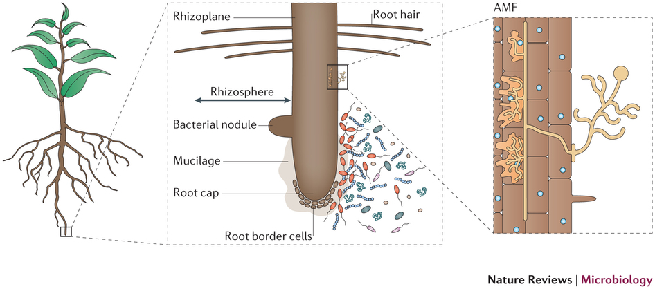

# Assignment 9: Metagenomics

## Background

Metagenomics is a rapidly expanding field with the power to explain microbial communities with a very high resolution by leveraging next generation sequencing data. There are applications in the clinic, ecological environments, food safety, and others. By definition, metagenomics is the study of a collection of genetic material (genomes) from a mixed community of organisms typically microbial.  

Today we will walk through a common metagenomics workflow using [QIIME2](www.qiime2.org) (pronounced "chime") and [phyloseq](https://joey711.github.io/phyloseq/index.html) by completing the following:

1. Determine the various microbial communities in our samples
2. Calculate the diversity within our sample (alpha diversity)
3. Calculate the diversity between different sample types (beta diversity)

*Acknowledgement must be paid to Professor Scott Dawson for sharing his original metagenomics lab that we have adapted for this class, to the Sundaresan Lab for sharing the data from their [publication](http://www.ncbi.nlm.nih.gov/pubmed/25605935), and to former TA Kristen Beck who wrote this version of the lab.*

## Clone your repository

Clone your Assignment_9 repository

+ cd into the repository
+ There will be an assignment template for today's lab.

## Install QIIME2
Quantitative Insights Into Microbial Ecology or [QIIME2](http://qiim2e.org/) is an open-source bioinformatics pipeline for performing microbiome analysis from raw DNA sequencing data. It has been cited by over 2,500 peer-reviewed journals since its [publication](http://www.nature.com/nmeth/journal/v7/n5/full/nmeth.f.303.html) in 2010.  

In terminal:

```{bash, eval=FALSE}
cd ~/Downloads
wget https://repo.anaconda.com/miniconda/Miniconda3-latest-Linux-x86_64.sh
bash # change to the bash shell
bash Miniconda3-latest-Linux-x86_64.sh #run installer for conda
eval "$(/home/ubuntu/miniconda3/bin/conda shell.bash hook)"
```

When asked, answer "yes" to agree to the licence, "yes" to keep the default installation directory, and "yes" to initialize Miniconda3.

next, install qiime2
```{bash, eval=FALSE}
wget https://data.qiime2.org/distro/core/qiime2-2019.4-py36-linux-conda.yml
conda env create -n qiime2-2019.4 --file qiime2-2019.4-py36-linux-conda.yml

rm qiime2-2019.4-py36-linux-conda.yml
```

Now activate qiime2 (still in terminal)
```{bash}
conda activate qiime2-2019.4
source tab-qiime
```

Note: you must be in `bash` rather than `fish` to activate conda.  So, if you get an error `conda: command not found` then type `bash` first.


## Data

Switch to your `Assignment_9` directory

```{bash, eval=FALSE}
cd ~/Assignments/Assignment_9_Maloof.Julin
```

Download and unzip the data files:

```{bash, eval=FALSE}
wget http://jnmaloof.github.io/BIS180L_web/data/MetaGenomeData.tar.gz
tar -xvzf MetaGenomeData.tar.gz
```

## Background for our Data
Today, we will be working with the samples collected from the rhizosphere of rice plants. The rhizosphere is an area of soil near the plant roots that contains both bacteria and other microbes associated with roots as well as secretions from the roots themselves. See diagram below from [Phillppot et al., *Nature*, 2013](http://www.nature.com/nrmicro/journal/v11/n11/full/nrmicro3109.html).
 

In order to classify microbial diversity, metagenomics often relies on sequencing 16S ribosomal RNA which is the small subunit (SSU) of the prokaryotic ribosome. This region has a slow rate of evolution and therefore can be advantageous in constructing phylogenies. For this lab, samples for various soil depths and cultivars were sequenced with Illumina sequencing. The de-multiplexed reads that we will be working with are in `RiceSeqs.fna`, and the sample information is in `RiceMappingFile.txt`.


The naming conventions of the Sample IDs are a little abstract, so I have created a **quick reference** table for you here.

| Cultivar              | Source        |
|:----------------------|:-----------------|
| NE = Nipponbare Early | M = 1mm soil     |
| NL = Nipponbare Late  | B = root surface |
| I  = IR50             | E = root inside  |
| M  = M104             |                  |

\* Technical replicates are indicated with 1 or 2


## Explore and Quality Control Data
Often times, as bioinformaticians, we will receive data sets with little background. Sometimes the first step is to explore the raw data that we will be working with. This can help us spot inconsistencies or logical fallacies down the line when working with more automated pipelines.  

Open RiceMappingFile.txt with `less` to view more information about the data you are working with. This file contains information about each sample including the cultivar, treatment, and number of technical replicates. It also includes the barcodes used to identify each sample during multiplexing. Let's use the barcodes to determine if we have an similar number of reads per sample ID.  

In the RiceSeqs.fna file, barcodes for each sequence are indicated in the header with `new_bc=`. These barcodes are also mapped to the sample information in RiceMapping.txt. Try to determine the number of sequences present for each barcode. This can be accomplished using just Linux/Unix commands. I'll start by giving you the tools, so you can try to piece together the command on your own. 

**Helpful Commands (in no particular order):** `cut`, `grep`, `head`, `sort`, `uniq` and good 'ol `|` to chain the commands together.

If you get stuck, highlight the hidden text underneath this sentence for one potential solution to identifying the barcodes themselves.  
<font color="white" face="menlo">
grep ">" RiceSeqs.fna | cut -d " " -f 4 | sort | uniq -c
</font>

**Exercise 1:**
Using information in the RiceMappingFile.txt and RiceSeqs.fna answer the following questions. Are the number of sequences for each sample approximately the same or are there any outliers? If so, which samples do they belong to? Could a different number of sequences per sample affect future analysis? Explain your reasoning.

Now that we've poked around in our raw data, let's carry on with analyzing the microbes present in our samples.

## Import the data into QIIME2

We are using data that has already been partially processed from fastqq files.  It has been trimmed and cleaned and converted into a ".fna" file.

Qiime keeps all data in .qza files.  We initiate such a file with our sequences using the command:

```{bash, eval=FALSE}
qiime tools import \
  --input-path Data/RiceSeqs.fna \
  --output-path Data/RiceSeqs.qza \
  --type 'SampleData[Sequences]'
```

## Dereplicate the sequences

The oddly nammed procedure of "dereplicating" counts the number of occurences of each unique sequence in each of your sample.s

```{bash, eval=FALSE}
qiime vsearch dereplicate-sequences \
  --i-sequences Data/RiceSeqs.qza \
  --o-dereplicated-table Data/RiceTable.qza \
  --o-dereplicated-sequences Data/RiceRep-seqs.qza
```


## Classify Various Microbiome Sequences into OTUs
Operational taxonomical units (OTUs) are used to describe the various microbes in a sample. OTUs are defined as a cluster of reads with 97% 16S rRNA sequence identity. We will use QIIME to classify OTUs into an OTU table.


```{bash, eval=FALSE}
qiime vsearch cluster-features-de-novo \
  --i-table Data/RiceTable.qza \
  --i-sequences Data/RiceRep-seqs.qza \
  --p-perc-identity 0.99 \
  --o-clustered-table Data/RiceTable-dn-99.qza \
  --o-clustered-sequences Data/RiceRep-seqs-dn-99.qza
```


```bash
cd ../
pick_de_novo_otus.py -i Data/RiceSeqs.fna -o otus
```
`-i` designates the input file with our DNA sequences  
`-o` designates the folder for our output  
The syntax to designate input and output files is consistent across QIIME commands.
**Note:** this command takes ~15 minutes to run.  If you get tired of waiting, then type "ctrl-c" to stop and download our pre-run version with:

```
wget http://malooflab.phytonetworks.org/downloads/BIS180L/otus.zip
unzip otus.zip
```

Let's view the statistics of the OTU table (a binary file) and save the output.

```bash
biom summarize-table -i otus/otu_table.biom > otus/otu_class.txt
```
**Exercise 2:**
From the OTU summary, look at how many OTUs correspond to each sample ("counts/sample detail"). Do technical replicates agree with one another? At this stage, what conclusions can you draw about the number of OTUs in these samples?  

*Note:* The OTUs actually match 1:1 with the number of sequences per sample ID/barcode (good thing we explored the quality of the data in exercise 1). This is an artifact of creating the smallest demo data set to use For this lab. The OTUs are still representative of the microbial diversity in that sample though.

As we learned last week, we can rely on the human eye to help pick out patterns based on color. We are going to make a heat map of the OTUs per sample. The OTU table is visualized as a heat map where each row corresponds to an OTU and each column corresponds to a sample. The higher the relative abundance of an OTU in a sample, the more intense the color at the corresponding position in the heat map. OTUs are clustered by [UPGMA hierarchical clustering](http://en.wikipedia.org/wiki/UPGMA). QIIME indicates the biological classification by prefixing the level for example "p\_" indicates phylum and  "g\_" indicates genus. For a refresher on biological classification, view this [helpful wiki page](http://en.wikipedia.org/wiki/Bacterial_taxonomy).  

```bash
make_otu_heatmap.py -i otus/otu_table.biom -o otus/OTU_Heatmap.pdf
```

Use `WinSCP` to copy the file to your PC.  The right-click on it in the WinSCP pane and click "open".  (If you double-click it in WinSCP you will see the raw file).

**Exercise 3:**
Although, the resolution of the y-axis makes it difficult to read each OTU, it is still a valuable preliminary visualization. What types of information can you gain from this heat map? Are there any trends present at this stage with respect to the various samples?  

Now we'd like to visualize our data with a little higher resolution and summarize the communities by their taxonomic composition.  

Use the following command to generate box and area plots to describe our samples.

```bash
summarize_taxa_through_plots.py -i otus/otu_table.biom -o otus/wf_taxa_summary -m Data/RiceMappingFile.txt
```
`-m` provides the path to the mapping file with sample meta data  

Copy the `wf_taxa_summary` folder to your PC with `WinSCP`.  Then right-click on the html files in the `wf_taxa_summary/taxa_summary_plots` folder to open them in your browser. Take a look at the different plots and tables that are generated. If it's hard to view the whole file, each of the plots are saved as PDFs in the `charts` folder within `taxa_summary_plots`.

This is a helpful visualization but QIIME offers even more power. There is another command line option to group the bar plots based on a shared characteristic. Open the help page (`-h`) or the QIIME documentation online for `summarize_taxa_through_plots.py`. Can you figure out which option you should use to change the summarization?

Give it your best shot and then highlight below this sentence to reveal how to summarize the OTU by category.
<font color="white" face="menlo">
summarize_taxa_through_plots.py -i otus/otu_table.biom -o otus/wf_taxa_summary_by_treatment -m Data/RiceMappingFile.txt -c Treatment
</font>
<p>
<font color="white" face="menlo">
summarize_taxa_through_plots.py -i otus/otu_table.biom -o otus/wf_taxa_summary_by_cultivar -m Data/RiceMappingFile.txt -c Cultivar
</font>
</p>

Copy the resulting folders to your PC and then use the results to answer:

**Exercise 4:**  

__a.__ When comparing by treatment, which groups are the predominant phyla in the different samples? (Remember phyla is designated by `_p`.) Are there any predominant groups unique to particular sample treatments?  

__b.__ When comparing by cultivar, are the predominant phyla consistent with those observed in Part A? Are there any predominant phyla unique to a specific cultivar? What does this indicate to you about the effect of the genotype and/or the effect of the treatment?  

Now that we know a little more information about the OTUs in our sample, we'd like to calculate the diversity within a sample --the alpha diversity-- and between our samples --the beta diversity.  

## Determine the Diversity Within a Sample
Alpha diversity tells us about the richness of species diversity within our sample. It quantifies how many taxa are in one sample and allow us to answer questions like "Are polluted environments less diverse than pristine environments?". 

There are more than two dozen different established metrics to calculate the alpha diversity. We will start with a small subset of methods. Feel free to read more details about other metrics [here](http://scikit-bio.org/docs/latest/generated/skbio.diversity.alpha.html).  

As we noted before, there are a different number of sequences per sample. When quantifying the alpha diversity, this could cause difficulties. However, *in silico* rarefaction analysis will account for this. Rarefaction provides a method of comparison between different communities, whereby each community is "rarefied" back to an equal number of sampled specimens. For example, a rarefaction with a depth of 75 is a simulation of what your sequencing results would look like if you sequenced exactly 75 reads from each sample. To look at alpha diversity systematically, we will performed many rarefactions to investigate the richness of our samples.

Compute the alpha diversity by generating rarefaction curves.

```bash
# first we must generate a file with parameters to be passed to the QIIME rarefaction script
echo alpha_diversity:metrics shannon,PD_whole_tree,chao1,observed_species > otus/alpha_params.txt

# make sure your file has been written to properly
less otus/alpha_params.txt

alpha_rarefaction.py -i otus/otu_table.biom -o otus/wf_arare -t otus/rep_set.tre -m Data/RiceMappingFile.txt -p otus/alpha_params.txt
```
`-m` passes the mapping information such as treatment or cultivar  
`-p` passes the methods used to calculate the alpha diversity  
`-t` passes the path to the phylogenetic tree file  

Copy the `wf_arare` folder to your PC and then open `rarefaction_plots.html`.  Test different parameters to plot the metric tested against a category such as Sample ID, Treatment, or Cultivar.

**Exercise 5:**  
Is there an alpha diversity metric that estimates the completeness of our sample diversity differently than the other metrics? If so, which one is it? Does this metric estimate a higher or lower sample diversity compared to the other metrics?

**Exercise 6:**  
__a.__ With Sample ID as the category, have we sequenced the full diversity possible for each sample? How do you know? Please indicate which metric(s) you used for your answer.  

__b.__ For Cultivar and Treatment, have we sequenced the full diversity of the various sites for all samples? How do you know?  

__c.__ Which treatment had higher phylogenetic diversity? Which cultivar had higher phylogenetic diversity?  

Now we will look at the diversity between our samples which is known as the beta diversity by plotting principal components and UPGMA trees.


## Determine the Diversity Between Samples

The definition of beta diversity has become quite contentious amongst ecologists. For the purpose of this lab, we will define beta diversity as the differentiation amongst habitats which is also the practical definition QIIME uses. To quantify beta diversity, QIIME calculates the pairwise dissimilarity between samples resulting in a distance matrix. For more information about other definitions/uses of beta diversity, see the [wikipedia page](http://en.wikipedia.org/wiki/Beta_diversity).

Now we can compute the beta diversity and generate PCoA plots.

```bash
beta_diversity_through_plots.py -i otus/otu_table.biom -m Data/RiceMappingFile.txt -o otus/wf_bdiv_even289 -t otus/rep_set.tre -e 289
```
*Note:* You may see an error about negative Eigenvalues, but the negative values are ~100x smaller than the positive values so we can ignore the warning.  

`-e` sets the sequencing depth per sample  

Why do you think we set the sequencing depth at 289 reads? That is the minimum number of sequences among any sample. This will ensure there is not bias by some samples having higher read depth than others.

This script returns a distance matrix and principal coordinate analysis (PCoA) plots. The dissimilarity between samples is measured by the UniFrac method which calculates the phylogenetic distance between sets of taxa. Weighted UniFrac (opposed to unweighted) accounts for the relative abundance of each taxa within the communities.

PCoA is also known as multidimensional scaling and you should be familiar with it by now from our earlier labs. If you'd like more information about the differences between PCoA and PCA, check out this [helpful blog post](http://occamstypewriter.org/boboh/2012/01/17/pca_and_pcoa_explained/) or [this course website](http://ordination.okstate.edu/overview.htm#Principal_coordinates_analysis).

**Exercise 7:**  
__a.__ Open the weighted and unweighted PCoA plots by copying their folder to your PC and then right-clicking on the index.html in their respective folders. How does adjusting the PCoA plots for taxa abundance (weighted) affect the clustering and principal coordinates?  
*Hint* On the colors tab, explore coloring by cultivar, treatment, etc.   

__b.__ What are the significant correlations of particular samples? Does cultivar or treatment appear to have more of an influence on the clustering?  
*Hint:* you can add labels to the plot to help visualize both characteristics at once.  


The distance matrix generated for beta diversity can also be used to make UPGMA trees. UPGMA is a simple hierarchical clustering method and can be used to classify sampling units on the basis of pairwise similarities.  

Let's utilize the beta diversity to generate UPGMA trees.  

```bash
 upgma_cluster.py -i otus/wf_bdiv_even289/unweighted_unifrac_dm.txt -o unweighted_upgma.tre
 upgma_cluster.py -i otus/wf_bdiv_even289/weighted_unifrac_dm.txt -o weighted_upgma.tre
 ```

+ Upload the weighted and unweighted UPGMA trees to [Phylodendron](http://iubio.bio.indiana.edu/treeapp/treeprint-form.html).  
+ "Tree diag" and "Phenogram" provide useful displays.

**Exercise 8:**  
Which sites cluster together? Which sites are different? How would you explain this pattern of diversity?  

**Exercise 9:**
Discuss some of the potential physiologies of the predominant groups of microbes correlated with the various rice microbiome samples. This information can be taken from the displays in Exercise 4.  
*Hint* Use [MicrobeWiki](http://microbewiki.kenyon.edu/index.php/MicrobeWiki) or other online sites to learn more about these microbes.  


