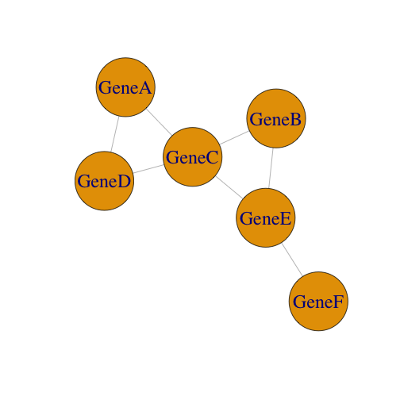

Gene Networks 2
========================================================
author: Julin Maloof
date: June 01, 2017
autosize: true

Clustering vs Networks
======================
* In the last lab you learned how to group genes into _clusters_ based on similar expression patterns.
* In this lab we extend this concept to build _gene networks_
* Gene networks are graphs that show connections between genes with similar expression.

Correlation Network
====================

* The goal is to connect genes with the most similar expression
* One simple way to do this is to use correlation as a measure of expression similarity
* _Why_ might we want to do this?

***

Correlation Matrix
===================
First calculate the correlation between each gene's expression across samples

|      | GeneA| GeneB| GeneC| GeneD| GeneE| GeneF|
|:-----|-----:|-----:|-----:|-----:|-----:|-----:|
|GeneA |  1.00|  0.12|  0.75|  0.86|  0.49|  0.32|
|GeneB |  0.12|  1.00|  0.92|  0.08|  0.88|  0.08|
|GeneC |  0.75|  0.92|  1.00|  0.81|  0.78|  0.02|
|GeneD |  0.86|  0.08|  0.81|  1.00|  0.28|  0.59|
|GeneE |  0.49|  0.88|  0.78|  0.28|  1.00|  0.78|
|GeneF |  0.32|  0.08|  0.02|  0.59|  0.78|  1.00|
***

Adjacency Matrix
================

Then create an adjacency matrix with "1" indicating genes that are correlated above a threshold, and "0" indicating below threshold.

Connect genes with a "1"

|      | GeneA| GeneB| GeneC| GeneD| GeneE| GeneF|
|:-----|-----:|-----:|-----:|-----:|-----:|-----:|
|GeneA |     0|     0|     1|     1|     0|     0|
|GeneB |     0|     0|     1|     0|     1|     0|
|GeneC |     1|     1|     0|     1|     1|     0|
|GeneD |     1|     0|     1|     0|     0|     0|
|GeneE |     0|     1|     1|     0|     0|     1|
|GeneF |     0|     0|     0|     0|     1|     0|
***

Terminology
===========
* Genes are _nodes_
* Connections between genes are _edges_

***

Limitations
===========
Correlation networks easy to make and easy to understand but have some limitations

Limitations
===========
Correlation networks easy to make and easy to understand but have some limitations

* Is a hard threshold proper?
* What is the right threshold?
* Are correlations even the right measure?
* Directionality?

More advanced methods:
======================

* Weighted Gene Correlation Networks [(WGCNA)](https://labs.genetics.ucla.edu/horvath/htdocs/CoexpressionNetwork/Rpackages/WGCNA/) (nice tutorials also Youtube videos)
* [Mutual Rank networks](http://atted.jp/help/mr.shtml) also see [here](https://www.ncbi.nlm.nih.gov/pmc/articles/PMC2762411/)
