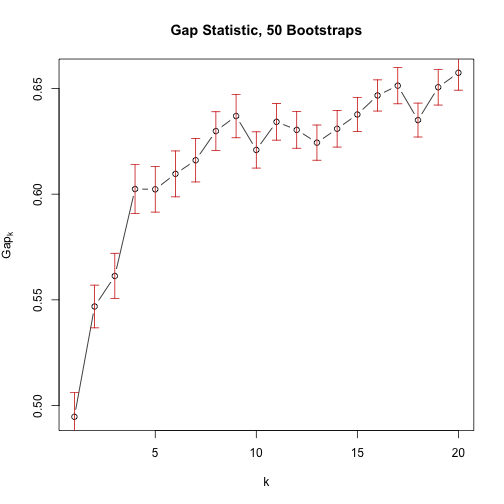
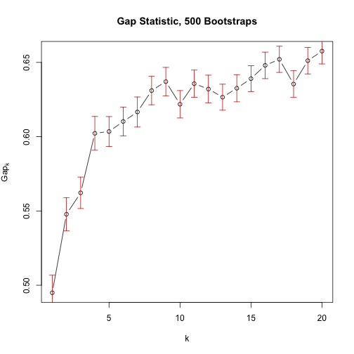

June 02 Questions
========================================================
author: Julin Maloof
date: June 02, 2017
autosize: true


What are some examples of edges in a transcriptional regulatory network?
========================================================

Discuss in class

In the lab from yesterday,
========================================================
_In the lab from yesterday, when we set the threshold to 0.85 we saw one large cluster and the rest of the nodes were largely independent. Why was there only one large cluster and what information about the data set can we learn from it?_

Discuss in class

Can you go over the 'nboot' function? What does it do?
========================================================

`nboot` is an argument, not a function, but...

bootstrapping is a method for determining error in estimates made from a given data set.

new data sets are created by randomly samply the original data set, with replacement.  So the new data set will be similar to the original but not exactly the same.

`nboot` controlls how many samples are taken.

Explain what AU/BP represents.
========================================================

BP is "Bootstrap percentage": The percentage of times that the node was observed among the bootstrap samples.

AU takes this, along with the number of bootstraps that were done to calculate a better estimate of confidence in the node.  

Do you expect more bootstraps to increase, decrease, or not affect our confidence?


Can you explain Gapk in the Gap statistic plot?
========================================================

As discussed in lecture:

Gapk is the difference in the _expected_ within-cluster variance and the _observed_ within-cluster variance.  If our clusters are real then they should reduce variance, increasing the gap.

From the clustering lab, when using clusGap, the y axis is the GAPk.
========================================================
_In this case are the terms "gap" and "variation" interchangeable? Is this referring the variation between each gene, or the variation between clusters as an average?_

Gap is the _difference_ in variation between expected and observed.

clusGap wierdness
========================================================
```
gap <- clusGap(GxE_counts, FUN = kmeans, iter.max = 30, K.max = 20, B = 50, verbose=interactive())

with(gap, maxSE(Tab[,""gap""], Tab[,""SE.sim""], method=""firstSEmax""))
```

_For k.max = 20; the command above gives k =4. Do we expect the out put of with command to change as we change the k.max value in the clusGap command?_

No...although in this case I know that it does.  It turns out that this is a result of having a small number of bootstraps (B=50) so that the Gapk is not getting consistenly estimated.  B=500 solves the problem (and returns k=8 for both K.max = 20 and K.max = 10)

let's look at the plot

clusGap wierdness 50 bootstraps
========================================================


k is "smallest k such that its Gap statistic is not more than 1 SE away from first local maximum".  It turns out that first local maximum is k=4


clusGap wierdness 500 bootstraps
=======

```r
set.seed(125)
gap500 <- clusGap(GxE_counts, FUN = kmeans, iter.max = 30, K.max = 20, B = 500, verbose=interactive())
plot(gap500, main = "Gap Statistic, 500 Bootstraps")
```



```r
#with(gap500,abline(h=Tab[8,"gap"]-Tab[8,"SE.sim"],col="red",lty=2))
#with(gap500, maxSE(Tab[,"gap"], Tab[,"SE.sim"], method="firstSEmax"))
```

Can you explain the diminishing return?
========================================================

Adding more k gives you smaller and smaller improvements in fit (i.e. in reducing variance within clusters)

Why did the R500 NDP Leaf data appear so unrelated to the rest of the sample data?
========================================================
_Was it for the purpose of the class or was that what was actually found?_

That is what was acutally found.

I need to go back and ensure that the data you received was normalized correctly.

For assignment 8 exercise 8, is there a way to label nodes?
========================================================

Look at the code


```
Error in plot(gene_graph85, layout = layout.fruchterman.reingold, vertex.size = 6,  : 
  object 'gene_graph85' not found
```
