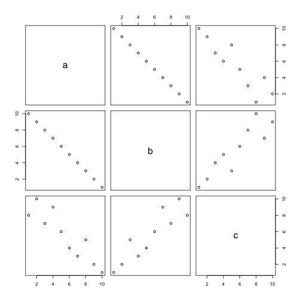

Questions May19
========================================================
author: Julin Maloof
date: May 19 2017
autosize: true

Would there be any useful information by looking at allele categories that have “2”, “3”, or “4”? 
========================================================
What do you think these categories are?


```r
head(subset(vcf.data,grepl("^2",IMB211),select=c(REF,ALT,IMB211)))
```

```
             REF                        ALT
7307    CTACAGCC          GTATAGCA,GTATAGCC
7337 CCTGAAAAAAG GCTGAAAAAAAG,CCTGAAAAAAAAG
7481         CTC          TTTT,TTTC,TTT,TTC
7482        ACAA                   GCAA,GCA
8026       CAAGC                AAAGC,AAAGT
8082        AAAA                  GAAA,GAAC
                                                                                                                                                             IMB211
7307                                                                                             2/2:4:0:0:0,4:0,123:-11.1888,-14.0574,-10.8646,-3.61236,-3.91339,0
7337                                                                                          2/2:19:0:0:2,15:65,500:-52.7588,-56.4005,-46.7946,-13.8474,-8.63683,0
7481 2/4:20:0:0:0,13,0,7:0,501,0,260:-62.3078,-62.3078,-62.3078,-21.4759,-21.4759,-17.5626,-62.3078,-62.3078,-21.4759,-62.3078,-41.2052,-41.2052,0,-41.2052,-39.098
7482                                                                                          2/2:12:0:0:1,11:25,346:-30.8414,-32.1867,-28.8753,-6.32163,-4.12403,0
8026                                                                                              2/2:2:0:0:0,2:0,59:-8.74939,-8.74939,-8.74939,-0.90309,-0.90309,0
8082                                                                                          2/2:11:0:0:1,10:26,343:-30.7745,-28.7445,-28.4435,-3.0103,-0.713051,0
```


What are the general criteria for picking SNPS that are useful for QTL analysis of F2 progeny (IMB211 x R500)?
========================================================

You want SNPs that when you seqeunce the F2 you can tell which parent the allele came from.


What is a large list in R and what is the best way to extract information from it? 
========================================================

A List is an object where each element can be another complex object (and they don't all need to be of the same type).


```r
# a list of three items, a string, numbers, and a matrix
my.list <- list(string="abbracadabra", joe=1:3, count=matrix(1:9,ncol=3))
my.list[2] # a list of length 1, containing the second item in my.list
```

```
$joe
[1] 1 2 3
```

```r
my.list[[2]] # the second item of my.list (a vector)
```

```
[1] 1 2 3
```

```r
# you can also extract by name
my.list["count"]
```

```
$count
     [,1] [,2] [,3]
[1,]    1    4    7
[2,]    2    5    8
[3,]    3    6    9
```

```r
my.list[["count"]]
```

```
     [,1] [,2] [,3]
[1,]    1    4    7
[2,]    2    5    8
[3,]    3    6    9
```

Large lists are the same as lists, but take up more memory.

Can you go over again the part in exercise 3 from lab 5 where we have to select SNPs for QTL analysis?
===================================================================================

What is the difference between R markdown and R notebook files?
===================================================================================

Very simimlar, but notebook files make a .nb.html as you go and preserve the output automatically.  R markdown files must be knitted to make a html

Can we integrate ggplot code and preview in r markdown? 
===================================
yes, once you knit

How do you find a SNP in an IGV?
=============================

How does ILLUMINACLIP recognize the specific sequence that we want to clip?
=====================

There is a folder in the Trimmomatic folder that has the sequences.


Can you explain why PCR changes the possibility of a SNP getting determined? 
======================

psuedo-replication.

How exactly do you use the pairs() function?
=========================
pairs will plot all possible pairs of columns against one another.  Similarly cor takes the pairwise correlation of all columns.

```r
m <- data.frame(
  a=1:10,b=10:1,c=sample(10))
pairs(m)
```



```r
cor(m)
```

```
           a          b          c
a  1.0000000 -1.0000000  0.1393939
b -1.0000000  1.0000000 -0.1393939
c  0.1393939 -0.1393939  1.0000000
```


How do we color each SNP for whether it is R500 specific, IMB specific, or common using vectors? (the "optional" question on Assignment 5.2)
===================


```r
my.data <- data.frame(
  R500=sample(c("0/0","1/1"),10,replace=T),
  IMB211=sample(c("0/0","1/1"),10,replace=T))
my.data
```

```
   R500 IMB211
1   0/0    1/1
2   0/0    0/0
3   0/0    0/0
4   1/1    1/1
5   0/0    0/0
6   1/1    1/1
7   1/1    1/1
8   1/1    1/1
9   0/0    0/0
10  0/0    1/1
```

```r
my.data$type <- ifelse(my.data$R500=="0/0" &
                         my.data$IMB211=="1/1","IMB.specific",
                       ifelse(my.data$R500=="1/1" &
                                my.data$IMB211=="0/0",
                              "R500.specific","common"))
my.data
```

```
   R500 IMB211         type
1   0/0    1/1 IMB.specific
2   0/0    0/0       common
3   0/0    0/0       common
4   1/1    1/1       common
5   0/0    0/0       common
6   1/1    1/1       common
7   1/1    1/1       common
8   1/1    1/1       common
9   0/0    0/0       common
10  0/0    1/1 IMB.specific
```


When we are looking at the SNP data between IMB211 and R500 why do we have to look at when both are 0/0 and 1/1 or 1/1 and 0/0? 
=========
Draw it out

How do you distinguish between novel transcripts and mismatches?
===============

How can you tell the difference between a sequencing error from machine vs from a human sample?
=================
I asssume "human sample" means true variation?  A sequencing error should only show up in a single or a few of the sequenced fragments, whereas a true SNP will be present in most reads (or 50% if het).

What are reasons that reads would not be mapped to the reference genome?
=======================

PCR is a common step for many experiments, and it leads to many problems if it goes wrong. What can we do to improve its accuracy? 
==========

What if we don't have reference genome to compare when we wanna find SNP?
=====================
You could assemble a genome or a transcriptome from your reads

Could you explain each important steps to find the SNP between two genomes?
======================
Not sure that this is asking beyond what you have done in the lab

* sequence
* use a program that make a statistical analysis of the data
* filter based on quality, read depth, etc.

How do you use the cor function correctly?
===============
_I realize the x variable needs to be numeric, yet the numeric variable is currently assigned to the y axis. Do we have to change this manually, or is there some other method while using cor?_

See above ansewr to pairs(); use is the same.

How do lists work in R? I've noticed it's quite different from what I've been taught to treat lists as in python or c...
=================
see above

What's the difference between GFF and GTF in terms of usage?
===============

It turns out that GTF is the same as GFF version 2.5  http://www.ensembl.org/info/website/upload/gff.html

GFF3 is an improved version. http://gmod.org/wiki/GFF3

The are similar in functionality but usually not interchangeable.


Does the IGV annotations use GFF annotation format? Also, does an ID for a feature necessarily need to be different from the parent ID, such that the ID for each exon in a gene should be different from the parent ID? 
===========
IGV supports the GFF2, GFF3 and GTF file formats.

https://software.broadinstitute.org/software/igv/GFF

Though it should be easier to align a shorter sequence to a reference genome, I saw some examples of "over trimming" and sequences being too short for an alignment using tophat. What aspects about really short reads makes a sequence unmappable to the reference genome?
=================

Take this to the extreme.  What if you read was 3bp long.  What would happen?

