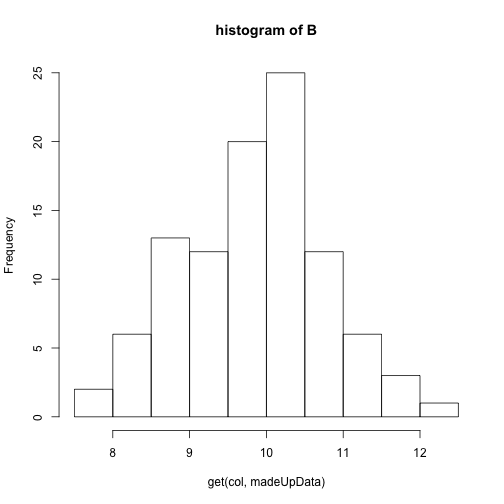
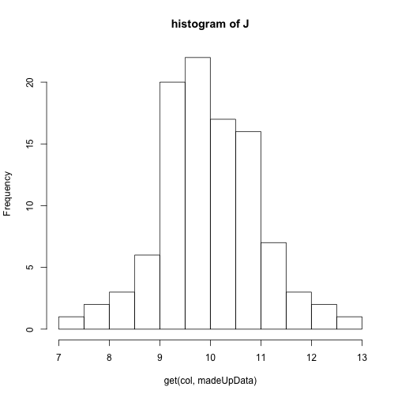

Questions May25
========================================================
author: 
date: 
autosize: true

How does Revigo take the GO values and P values to get the results? What is the relationship between these two values?
=====================

* The GO values are identifiers for specific ontology terms
* The p-values are whether specific GO terms are over-represented in our gene list


Can you go over the TreeMap in REVIGO?
=====================


Are there any other ways to test if genes are differentially expressed other than the ones discussed in class? /  What is the difference between DESeq and edgeR? When would you use one over the other?
=====================
There are many different programs that do this.  See http://rnajournal.cshlp.org/content/22/6/839.long for a comparison of nine of the most popular ones.

I noticed the webpage with the motif information included the genomic sequence, and that some of the motifs had similar sequences. Although there was a motif that had the most enrichment, wouldn't it be possible for other motifs with a similar sequence to also be highly enriched? What could account for the difference of enrichment if the genomic sequences are so similar (assuming the function is also similar)?
=====================
Yes, multiple could be enriched

But...1bp mismatch really can make a difference...

List some common mistakes in the experiments, and what are ways to fix them?
=====================
* _library mixup / mislabelling._ This can be detected on the BCV plot and maybe fixed by sample swap...
* _poor experimental design._  Be sure to use proper randomization and blocking protocols.
* _poor library prep_ Practice!

How do you plot multiple variables in a histogram without melting?
=====================
Use a for loop to loop through the column names

```r
madeUpData <- as.data.frame(matrix(rnorm(1000,mean = 10),ncol=10,dimnames=list(NULL,LETTERS[1:10])))
round(head(madeUpData),2)
```

```
      A     B     C     D     E     F     G     H     I     J
1  8.33 10.31  8.96  9.46  9.77 10.90 11.54 10.27  9.72 10.89
2  9.13  9.29  9.91  8.04  9.91 10.91  9.50 10.49  9.26  9.02
3 10.54  9.93 11.14 11.36 10.06  9.47  9.47 11.37  8.28  7.01
4 10.46 10.28  9.52 10.11  7.60  9.03  9.08  9.28  8.61 10.54
5 10.18  8.86 10.23  9.80  8.75  9.71 12.89  9.63 10.62 11.10
6  9.52 11.29  7.40  8.98  9.78  8.27 10.67  8.30 11.40  9.31
```

How do you plot multiple variables in a histogram without melting?
=====================
Use a for loop to loop through the column names

```r
for(col in colnames(madeUpData)) 
  hist(get(col,madeUpData),main=paste("histogram of",col))
```



What is the difference between read.table vs read.delim? When can each be used?
=====================
`read.table` is a generic method for importing spreadsheets and you have to specify many of the options (like what the delimiter is).

`read.delim` essentially calls `read.table` but with options already filled in for a tab-delimited file.

`read.csv` essentially calls `read.table` but with options already filled in for a comma-delimited file.


For assignment 6, part 1, question 8a, how do you interpret the MDS plot?
=====================

* This plot shows the two main components of variation among samples.
* Samples that are closer together have more similar expression.
* So we hope that replicates are close and that conditions/treatments separate samples.

For assignment 6, I don't understand how to read the dispersion plot and what it means?
=====================

* each point is a gene
* y-axis is biological coefficient of variation ($ Std. Dev \div Mean), related to dispersion.
* x-axis expression level
* lines show "common" dispersion or dispersion trend by expression level

In what context would it be appropriate to use RPKM?
=====================

NEVER!

Just kidding...for visualization, especially if trying to compare between genes.

Could you briefly explain the difference between p-value and false discovery rate, and why FDR is preferred in the labs we're doing
=================================
incremental:true
* This goes back to multiple testing.  We are testing differnetial expression of 30,000 genes.
* Thought experiment: Take 6 replicates of the same genotype and treatment (say R500 in NDP) and arbitrarily split them into two groups and test for differential expression
* How many genes would be significant at 0.05?
* 30000 * 0.05 = 1,500!
* FDR corrects for this.
* FDR of 0.05 means that 5% of the genes at this significance level are expected to be false positives.

what does the 'sort=' argument do in merge() function
=====================
Try it both ways and look at the result! 

Or read the help!

Can you walk us through the coding or explain how the coding works for the dispersion models/ finding top 10 genes, etc? (assignment 6.1)
=====================

How is the genotype x treatment term in the last exercise of Assignment 6 Part 1 created?
=====================

Can you explain how the TMM normalization method works?
=====================
I will try to put something together for Tuesday

