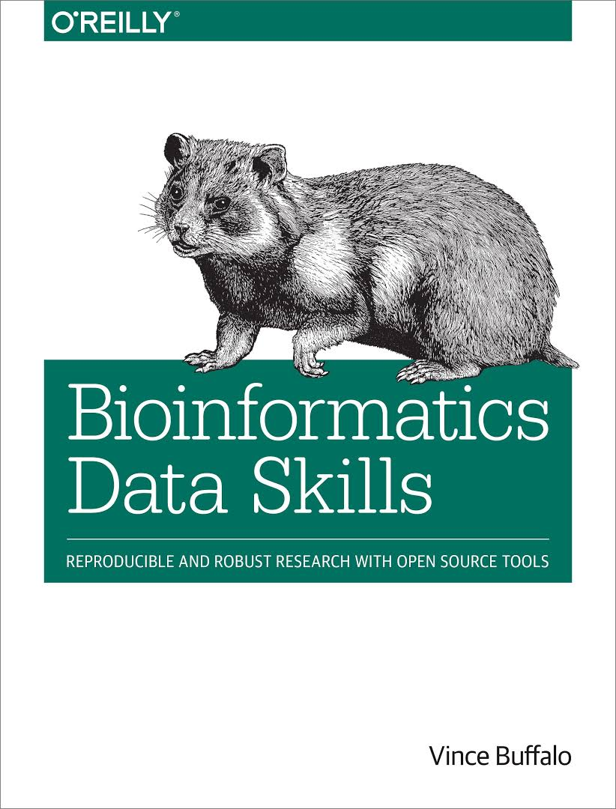
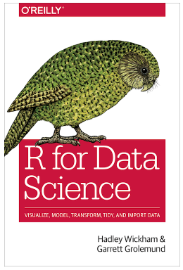
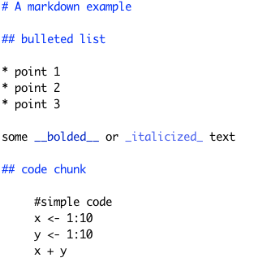
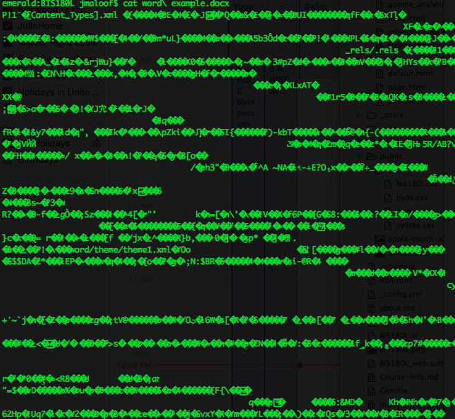

Welcome to BIS180L 
========================================================
author: Julin Maloof
date: April 03, 2018

Course Personnel
=======================================================

__Instructor:__ Julin Maloof <jnmaloof@ucdavis.edu>

__Teaching Assistant:__ Jiadong Ni <jni@ucdavis.edu>

__Extra Help (today):__ John Davis

What this course is about
========================================================
incremental: true

The goal of this course is to introduce you to the _tools_ and _thinking_ required for bioinformatics analysis.

* Introduction to Linux command line
* Introduction to R
* Hands-on experience analyzing genomics data
* Principles of good analysis

This is a computer-based class.  No bench work.

Why R and Linux?
================
incremental:true
* Both R and Linux have command-line interfaces
* Antiquated?
* NO! Written code provides __flexibility, creativity, and power__ not available in any other way
* Linux (or Unix / Mac)
  * Outstanding built-in tools for data crunching
  * Provides access to hundreds of bioinformatics programs
* R 
  * Powerful statistical, data processing, and graphical capabilities
  * Many bioinformatics packages are developed in R
  
And
===
[coding is cool](http://www.huffingtonpost.com/2013/02/27/code-org-video_n_2767453.html)

“Every student deserves the opportunity to learn computer programming. Coding can unlock creativity and open doors for an entire generation of American students. We need more coders — not just in the tech industry, but in every industry.” – Mark Pincus, CEO and Founder, Zynga

“Coding is engaging and empowering. It’s a necessary 21st Century skill.” – Jan Cuny, Program Officer, National Science Foundation

“Code has become the 4th literacy. Everyone needs to know how our digital world works, not just engineers.” – Mark Surman, Executive Director, The Mozilla Foundation

“If you can program a computer, you can achieve your dreams. A computer doesn’t care about your family background, your gender, just that you know how to code. But we’re only teaching it in a small handful of schools, why?” – Dick Costolo, CEO, Twitter

Course Schedule
========================================================

* __Tuesdays, Thursdays__ 
  * Lecture 1:10 - 2:00
  * Lab 2:10 - 5:00
  * Often lecture will be shorter than 1 hour.  We will start lab work as soon as lecture is over.
  
*** 

* __Fridays__
  * Discussion 1:10 - 2:00
    * Varied use
      * Q & A (with student helping to A as well as Q)
      * lecture
      * Keep on working

(Tentative) Course Outline
==============
incremental: true
* Week 1-2:
  * Linux fundamentals
  * Markdown, git repositories
  * Sequence analysis and BLAST
* Week 3: 
  * R fundamentals
* Week 4:
  * SNPs
  * population structure, GWAS
* Week 5:
  * Build a web-app
  
*** 

* Weeks 6-7:
  * Illumina reads
  * RNAseq
* Week 8: 
  * Genetic Networks
* Week 9:
  * Metagenomics
* Week 10
  * TBD
  
Course Grading
==============

* 45% Lab assignments
* 25% Take home midterm (Available May 4, __Due May 10, 1:10 PM__)
* 25% Take home final (Available June 5, __Due June 11, 9:00 AM__)

Do your own work
=================
incremental: true

Developing code is an interactive process.  Both your friends and the web can be excellent resources.

__However__ Any direct copying of text or code __from any source__ is considered plagiarism in the context of this course.

If you receive inspiration or ideas from an external source __give attribution__

Course Website
==============

* Main website: http://jnmaloof.github.io/BIS180L_web/
  * Lab instructions
  * Course Schedule
  * Helpful Links (to be updated as we go)
  * Reading assignments (to be updated as we go)
  
* Canvas
  * Gradebook

Reference Text
==============

***

This is an excellent book that covers much of the material that is covered in lab.

You can use this to help with ideas that are not clear from class, or for more in depth coverage of the material.

I particularly recommend reading it in depth for anyone planning to build on the skills learned in this class.

It is available online for free, through UCD library.  See links on course website.

Reference Text2
==============

***

This is another excellent book that more generally covers data manipulation and analysis in R.

The author, Hadely Wickham, has built some very nice additions to R that we will make use of in this class.

Why are we here?
================
incremental: true
And what is bioinformatics?
* OK so it is a requirement, but what else?

Three principles of bioinformatics
==================================
transition: rotate

1. Clear documentation
2. Reproducible results
3. Documents/Data in open (non-proprietary) formats
  * This is essential for achieving 1 and 2
  
Today's Lab
==========
type: section
transition: rotate

1. __Get a virtual linux machine running__
2. Learn a little markdown
3. Learn a little Linux command line

Virtual Linux machine
=====================
incremental: true

* The computer lab machines run Windows
* Bioinformatics on a Windows machine is painful (although getting better) (R is OK)
* Solution: virtual machine!
* Use [Amazon Web Services](https://aws.amazon.com/) to run a virtual Linux machine in the cloud
* You can connect to your virtual machine from any computer, including your laptop or home computer

What is a virtual machine?
==========================
incremental: true

* Amazon has many very large computers (a.k.a. servers) in various places around the country
* These servers can be split up to be many separate "virtual" machines, each emulating an individual computer
* You can connect to these virtual machines and it just like having your own computer, but it is in the "cloud"
* Terminology:
  * Each virtual machine is an __instance__ of a machine __image__.
  * You can think of the image as a snapshot of a machine that captures the OS, the installed programs, etc.  
  * The image that you are using is called BIS180L and was created by John Davis and myself for this class.

Connecting to the virtual machine
=================================
incremental: true

* There are two ways to connect to your instance:

1. Using a Virtual Network Connection (VNC).  This allows the graphical display of the instance to be displayed on your local computer
2. Using a secure shell (SSH).  This provides a text connection to your instance.  An advantage for slow internet connections.

Other virtual machine notes
=======
incremental:true

As detailed in the lab notes for today:

* You will need to register for an account at AWS
* As you UC Davis student you get $100 credit.  That should easily be enough to complete this class (800 - 1500 hours of compute time) __If you stop your machine when not in use__
* __It is very important that you stop your machine when not in use__
* If you are already running Linux, or want to try installing the relevant software on your Mac, I can give you installation notes. 

Today's Lab
==========
type: section
transition: rotate

1. Get a virtual Linux machine running
2. __Learn a little markdown__
3. Learn a little Linux command line

Markdown
========

Markdown is a text-based formatting system for quickly and easily generating nicely formatted output.

This presentation as well as the entire BIS180L website was written in markdown.

It helps achieve all three guiding principles:

1. Clear documentations
2. Reproducibility
3. Open formats

Markdown vs docx
================
What is we want to produce this:

***

The markdown file that generates it is

Markdown vs docx
================
What is we want to produce this:

***

The word file that generates it is

Today's Lab
==========
type: section
transition: rotate

1. Get a virtual Linux machine running
2. Learn a little markdown
3. __Learn a little Linux command line__

Linux Command Line
===================

We will work through a tutorial developed by Ian Korf.

You are learning a new language; treat it as such.
* Keep notes
* Be patient
* Practice and repetition help
* It will get easier

Assignments to turn in for this lab
==============
We will provide a system for turning in assignments later this week or next week.

In the meantime, keep:

* The file from the markdown tutorial
* The notes (in Markdown!) from the Linux tutorial
* The answer to "Exercise 1" from the Linux tutorial

Lets go have fun!
=================
type: section

