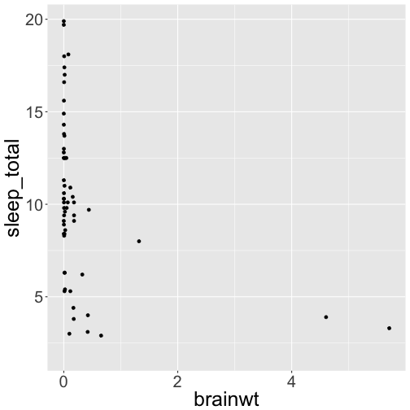
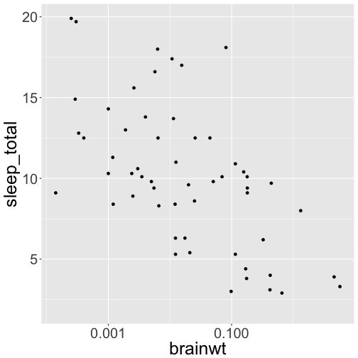
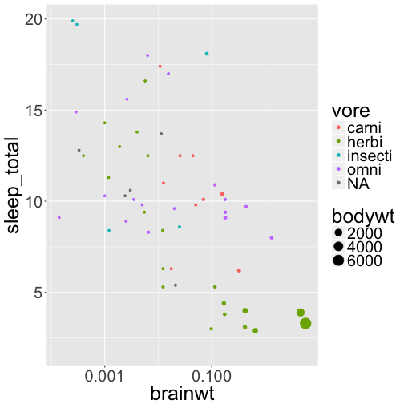
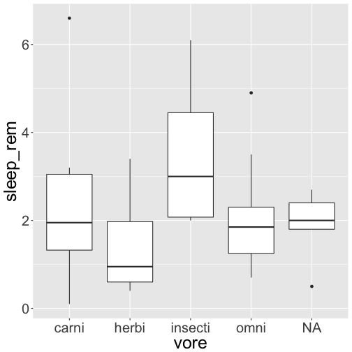
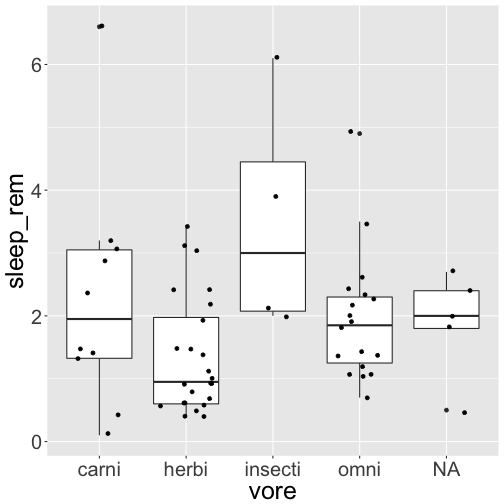

ggplot primer
========================================================
author: Julin Maloof
date: 
autosize: true

ggplot: easy and elegant graphs in R
========================================================

* ggplot is an add-on package for R
* It allows easy creation and manipulation of plots
* Like many things it takes a bit of getting used to...

ggplot: load the library
========================
first you need to load the library (once per session)


```r
library(ggplot2) #load the library
data(msleep) # load a data set on mamallian sleep patterns
str(msleep)
```

```
Classes 'tbl_df', 'tbl' and 'data.frame':	83 obs. of  11 variables:
 $ name        : chr  "Cheetah" "Owl monkey" "Mountain beaver" "Greater short-tailed shrew" ...
 $ genus       : chr  "Acinonyx" "Aotus" "Aplodontia" "Blarina" ...
 $ vore        : chr  "carni" "omni" "herbi" "omni" ...
 $ order       : chr  "Carnivora" "Primates" "Rodentia" "Soricomorpha" ...
 $ conservation: chr  "lc" NA "nt" "lc" ...
 $ sleep_total : num  12.1 17 14.4 14.9 4 14.4 8.7 7 10.1 3 ...
 $ sleep_rem   : num  NA 1.8 2.4 2.3 0.7 2.2 1.4 NA 2.9 NA ...
 $ sleep_cycle : num  NA NA NA 0.133 0.667 ...
 $ awake       : num  11.9 7 9.6 9.1 20 9.6 15.3 17 13.9 21 ...
 $ brainwt     : num  NA 0.0155 NA 0.00029 0.423 NA NA NA 0.07 0.0982 ...
 $ bodywt      : num  50 0.48 1.35 0.019 600 ...
```


ggplot: key concepts
========================================================

* We create a plot _object_ that contains the specifications of how we want our data to be plotted.
* _Aesthetics_ control how the data is mapped onto the plot
* _Geometries_ specify the type of plot to make
* The plot object can have many elements added to it.
* When it is ready we can plot it to the screen 


ggplot: example
========================================================

First create the plot object, specify data and mappings

```r
pl <- ggplot(data = msleep, mapping = aes(x=brainwt, y = sleep_total))
```

Now add a geom

```r
pl <- pl + geom_point()
```

Plot it

```r
pl
```



ggplot: modify x-axis
=====================
Data points on the x-axis are scrunched at the left-hand side, suggesting that we might want to transform our scale.  We can do that by adding a modifier:

```r
pl + scale_x_log10()
```


Note that this did not update the plot object `pl`.  If we want to do that, then we need to:

```r
pl <- pl + scale_x_log10()
pl
```


ggplot: modify the points
=========================
One of the nice things ggplot is that the language of specifying plot elements is very clear.  For example if we want to color the points by another column in the data, such as vore (carnivore, omnivore, herbivore), then we just:

```r
pl <- pl + aes(color=vore)
```

Try having ggplot alter the point size by body weight

more about the `aes()` function
==============================
`aes` can be defined on their own or in the ggplot call (in both cases they apply globally) or within a geom iteself.  So we could have:


```r
pl <- ggplot(data=msleep, aes(x=brainwt, y=sleep_total, color=vore)) # set x, y, and color for all geoms
pl <- pl + geom_point(aes(size=bodywt)) #only for this geom
pl <- pl + scale_x_log10()
pl
```




ggplot: boxplots
=================
Boxplots are very useful for displaying summaries of data.

Try writing the code to make the following plot: (X-axis is vore, Y-axis is sleep_rem)



hint: you want to use the `geom_boxplot()`

ggplot: multiple layers
=======================

Plots can contain multiple layers, for example boxes and points.  


```r
pl2 <- pl2 + geom_point(position = position_jitter(width=.3))
pl2
```




Resources
=========

The online [Cookbook for R](http://www.cookbook-r.com/Graphs/) is an excellent resource for how to manipulate ggplots to your liking.

The [ggplot page](http://ggplot2.tidyverse.org/reference/)

[ggplow cheatsheet](https://www.rstudio.com/wp-content/uploads/2016/11/ggplot2-cheatsheet-2.1.pdf)


